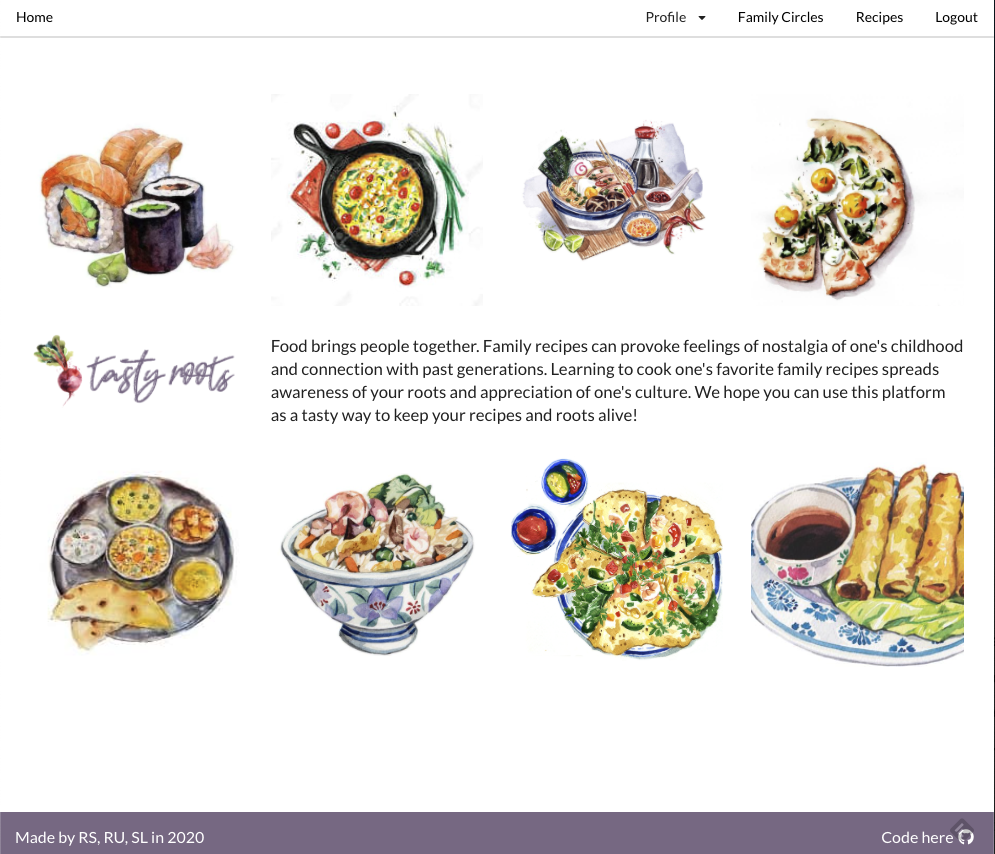
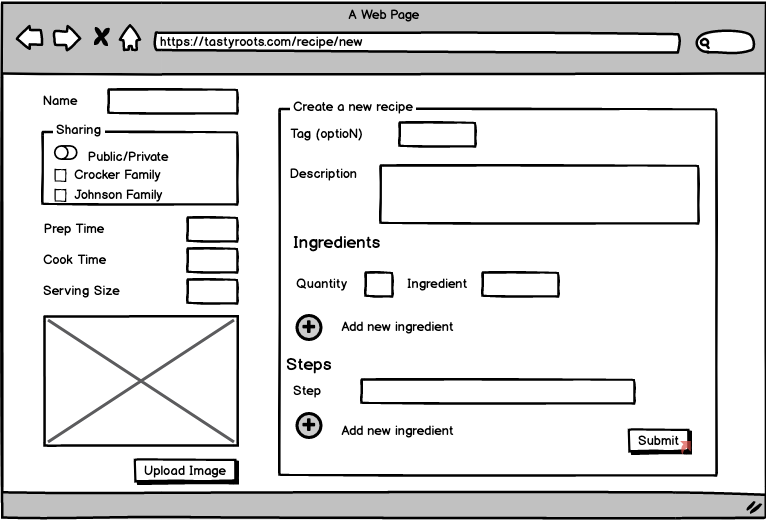
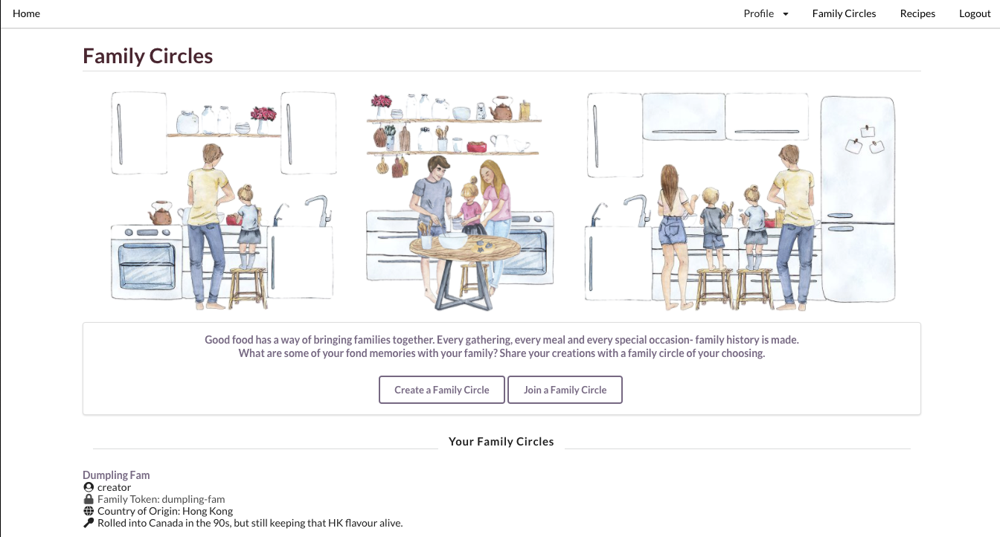
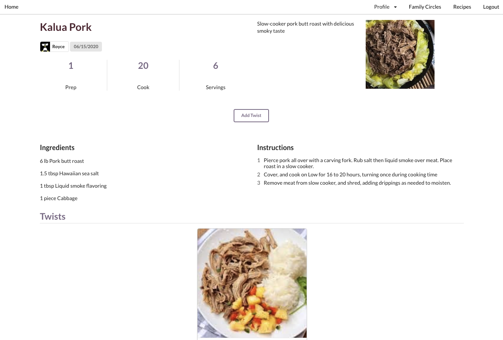

# Tasty Roots
MERN Family Recipe Sharing App - a tasty way to preserve family recipes and keep your roots alive!

- demo account: tasty@roots.com (tastyroots)

## About
Joined by their love of cooking and good food [Ruchita Sirkanungo](https://github.com/ruchitasir), [Sharon Lee](https://github.com/essleeung) and [Royce Ubando](https://github.com/royce-u) embarked on this journey to create a place to share recipes and keep their family traditions alive.

Tasty Roots is a community platform to connect families together and share recipes. Often after the passing of an older generation, the intricacies and measurements of a particular recipe may be debated or even lost. But fear no more- we have a feature for that! Twists can be added on recipes if you think your version is better. The application is deployed [here](http://tasty-roots-client.herokuapp.com/).

**Image 1. Home Page of App**

#### Technologies
This app was built with MongoDB, Express, React and Node, a sprinkle of Redux and utilizes JSON web tokens to authenticate users. Styling was done using React Semantic UI. The server side is deployed [here](http://tasty-roots-server.herokuapp.com/).

---

## Development Approach
Like any good team, a brainstorming session was immediately underway. For planning of this app, Balsmiq was utilized for basic wireframing, Trello for tracking progress on a kanban board and data schemas were designed with scalability in mind.

**Image 2. Wireframe of recipe creation**

### User Profiles
Key features we wanted to implement included the following: 
- Ability for user to create recipes (add ingredients, steps and picture)
- Ability to create family circles and invite members to join
- Ability to choose who they share it with (keep private, publicly with entire community or just their family circle)
- Ability to make twists with recipes shared in user's family circle or broader community

**Image 3. Family circle page**

**Image 4. Recipe page with twist option**

#### Routes
Server side
| Method | Path | Purpose |
|--------|------|---------|
| POST | /auth/login | User authentication and login |
| POST | /auth/signup | User account creation |
| GET | /familiy/:id| Return a single family circle - @param id = ID of the family circle to return  |
| POST | /family| Create a new family circle |
| PUT | /family | Join a family circle|
| GET | /profile | Return all current user info |
| PUT |  /profile |Update user's profile (picture and bio) |
| GET |  /recipe/public  | Return all public recipes |
| GET | /recipe/:id | Return a specific recipe - @param id = ID of the recipe to return |
| GET | /recipe/user/:id | Return all recipes of a particular user - @param id = ID of current user |
| GET | /twist/:id | Return all twists from a particular recipe - @param id = ID of the original recipe |
| POST | /recipe | Add new recipe |
| PUT | /recipe/:id | Edit existing recipe - @param id = ID of the recipe to edit |
| PUT | /recipe/sharedWith/:id | Edit existing recipe to share/unshare with a family circle - @param id = recipe ID, @returns = Recipe with a specific recipe ID |

#### Routes
Client side
| Path | Purpose |
|--------|------|
| / | Homepage |
| /profile/edit | Edit user profile |
| /profile | User profile |
| /recipes | Public recipes |
| /familycircle | User's family circles |
| /recipe/:id/twist | Create twist off of a particular ID - @param id = ID of recipe to twist off of  |
| /recipe/:id | Recipe show page |
| /family/:id | Family show page |

#### Future features

- Comment section on recipes
- Tags for filtering (included in current data schema)
- Search feature
- Further integration of redux to manage states
